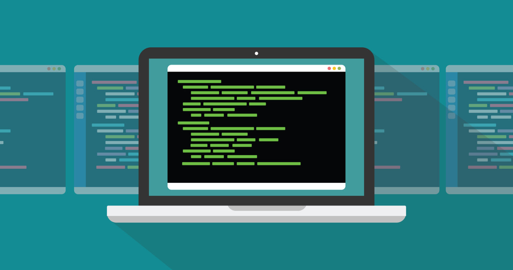

# Learning

Learn important **CLI** tools with examples.

    

## Table of content
| CLI            | Description                                                                                                                                                    |
|----------------|----------------------------------------------------------------------------------------------------------------------------------------------------------------|
| [cURL](./curl) | cURL is a computer software project providing a library and command-line tool for transferring data using various network protocols.                           |
| [npm](./npm)   | npm is a package manager for the JavaScript programming language.                                                                                              |
| [oc](./oc)     | with the OpenShift command-line interface (CLI), the oc command, you can create applications and manage OpenShift Container Platform projects from a terminal. |
| [Go](./go)     | Go programming language cli.                                                                                                                                   |